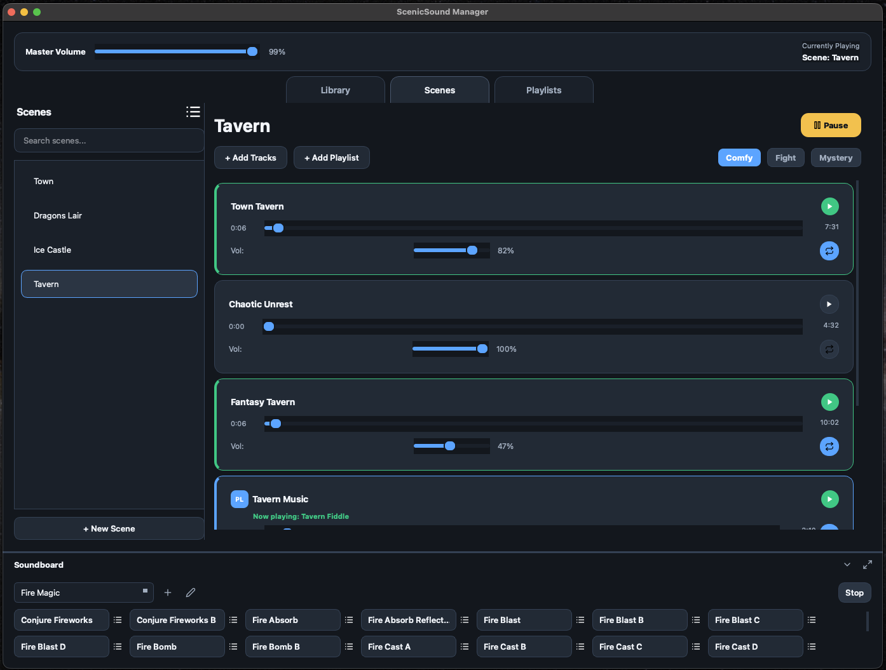
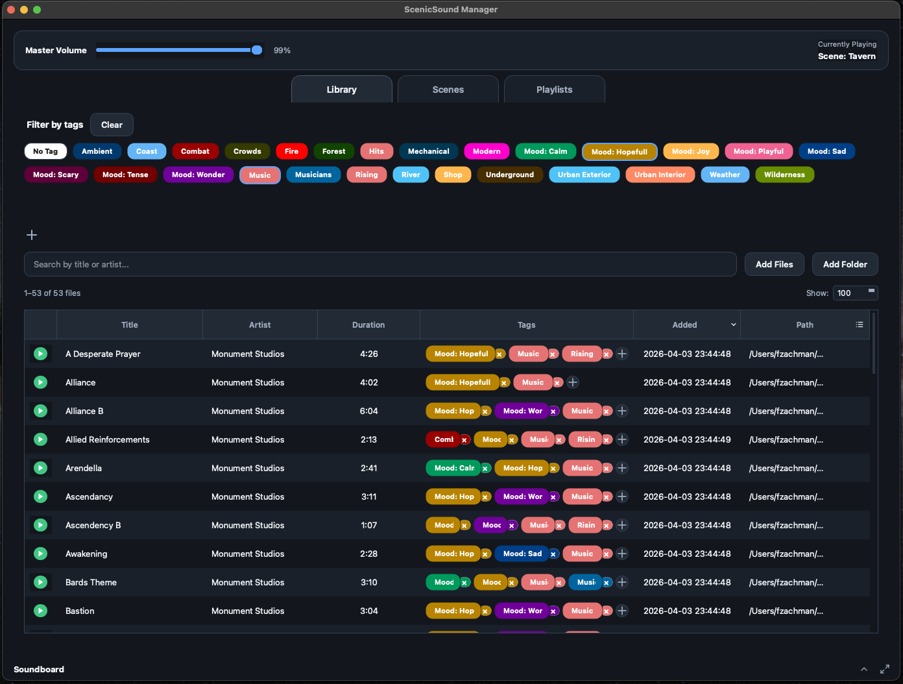

# ScenicSound Manager

A desktop **audio soundscape manager for tabletop RPGs** (D&D and friends). Build
layered ambient scenes, run music playlists, and switch between them live during a
session — all from one window.

Built with **PyQt6**, a **VLC** (libVLC) audio backend, and **SQLite** for
persistence.



> Note: this README is the user/contributor entry point. For architecture notes
> and conventions, see [`CLAUDE.md`](CLAUDE.md) and [`docs/`](docs/).

## Download

Get the latest beta from
[GitHub Releases](https://github.com/fzachman/ScenicSoundManager/releases): the
`-macos.zip` for macOS, or the `-windows.zip` for Windows. Both need
[VLC](https://www.videolan.org/vlc/) installed (the 64-bit version on Windows).
Each release's notes have the install steps.

## Features

- **Library** — import individual files or whole folders (including drag-and-drop),
  with automatic metadata extraction (title/artist/duration via mutagen),
  user-defined **tags**, and search.
- **Scenes** — layer multiple sounds *simultaneously* for ambient soundscapes
  (e.g. rain + tavern murmur + crackling fire). Each track has independent volume,
  repeat, and play/stop state. A scene can also embed **playlist entries** that
  play sequentially (or shuffled) within the scene.
- **Playlists** — ordered tracks played one at a time through a single player,
  with **smart shuffle** (avoids immediate repeats).
- **Live control** — only one scene *or* one playlist plays at a time; switching
  is coordinated automatically. A master volume applies across everything.
- **Soundboard** — a collapsible panel below the main window (pop-out-able into
  its own window) with named boards of one-shot sound effect buttons that play
  *over* the active scene/playlist. One sound at a time: a new press cuts over,
  pressing the playing button stops it.



Your library and scenes are stored in a local SQLite database:
`~/Library/Application Support/ScenicSound/soundmanager.db` on macOS,
`%LOCALAPPDATA%\ScenicSound\soundmanager.db` on Windows.

## Feedback & bug reports

The easiest way is the [feedback form](https://forms.gle/QyTAhJCRd18NvHNn6) —
takes a minute, no account needed. GitHub issues work too, and the
[ScenicSound Manager Discord](https://discord.gg/xj8X4VBF4N) is open for
questions, ideas, and beta discussion.

## Keyboard shortcuts

Transport keys work while the app window is focused (these are in-app shortcuts,
not global media keys). On macOS the modifier is **⌘ (Command)**; on Windows/Linux
it's **Ctrl**.

| Key | Action |
| --- | --- |
| **Space** | Play / pause. Pauses whatever is currently playing (from any tab); if nothing is playing, starts the scene or playlist open in the current tab. |
| **→** | Next track in the playing playlist. (Scenes layer many sounds at once, so they have no "next track" — this does nothing for a scene.) |
| **⌘← / ⌘→** | Select the previous / next scene or playlist in the current tab's sidebar. If something was already playing, the newly selected item starts playing. |

These yield to whatever you're interacting with: typing a space in a search box,
nudging a focused slider with the arrows, or activating a focused button with
Space all still work as normal.

## Remote control

The app runs a small WebSocket server on `ws://127.0.0.1:8765` so external
controllers (e.g. a Stream Deck plugin) can play scenes/playlists, toggle
play/pause, and set the master volume, with live now-playing state pushed back.
The protocol is documented in [docs/remote-protocol.md](docs/remote-protocol.md),
and `scripts/remote_client.py` is a small CLI for trying it:

```bash
# with the app running
venv/bin/python scripts/remote_client.py scenes        # list scenes with ids
venv/bin/python scripts/remote_client.py play-scene 3
venv/bin/python scripts/remote_client.py toggle
venv/bin/python scripts/remote_client.py volume 40
venv/bin/python scripts/remote_client.py watch         # stream state events
```

The server only listens on localhost. To turn it off or change the port, open
**Settings…** (in the app menu on macOS, ⌘,; in the File menu on Windows);
changes take effect immediately.

For Elgato Stream Deck owners there's a ready-made
[Stream Deck plugin](https://github.com/fzachman/SSMStreamdeckPlugin/releases)
built on this protocol — physical buttons for scenes, playlists, and
soundboard sounds.

## Requirements

- **Python 3.10+** (developed and tested on 3.13).
- **VLC / libVLC** available on the system — `python-vlc` binds to the installed
  libVLC. The simplest way to get it is to install
  [VLC media player](https://www.videolan.org/vlc/). On Linux, install the
  distro's `libvlc`/`vlc` packages.
- Python dependencies (PyQt6, python-vlc, mutagen, structlog) — see
  [`requirements.txt`](requirements.txt).

Primarily developed on macOS; CI runs the test suite on Linux and Windows, so
the app and tests are cross-platform. Packaged builds exist for macOS (built
locally) and Windows (built by CI) — see below.

## Setup

```bash
# from the repo root
python3 -m venv venv
source venv/bin/activate
pip install -r requirements.txt
```

## Running

```bash
./run.sh
# or, with the venv active:
python main.py
```

## Building the macOS app

```bash
python setup.py py2app        # production standalone build
python setup.py py2app -A      # development alias mode (faster; needs the source tree)
```

The build doesn't bundle VLC: the app uses the
[VLC.app](https://www.videolan.org/vlc/) installed on the Mac, and prompts with
a download link if it's missing.

## Building the Windows app

Windows builds are made by CI only — PyInstaller can't cross-compile from
macOS. The [Windows build](.github/workflows/windows-build.yml) workflow runs
on every push to `main`, `feature/**`, and `fix/**`: it runs the test suite on
Windows, builds [`windows.spec`](windows.spec) (a one-folder, windowed
PyInstaller build), smoke-tests the exe, and uploads
`ScenicSoundManager-<version>-windows.zip` as an artifact on the run page.
`just release` attaches that exact zip to the GitHub release. Like the macOS
app, it doesn't bundle VLC; users install the 64-bit version.

## Development

```bash
# run the test suite
venv/bin/pytest tests/ -v

# lint, format check, and (advisory) type check
venv/bin/ruff check app/ tests/
venv/bin/ruff format --check app/ tests/
venv/bin/mypy app
```

`ruff` (lint + format) and `pytest` are gating in CI (GitHub Actions); `mypy` runs
as advisory. Dependency bumps come through Dependabot PRs, which CI validates.

## Project layout

```
app/
  audio/      AudioEngine (VLC), TrackPlayer, SceneMixer, ScenePlaylistPlayer, SmartShuffle
  database/   SQLite CRUD (connection.py), dataclass models, schema.sql
  library/    audio import, metadata extraction, tagging, search
  scenes/     scene management, multi-track mixing, playlist-in-scene support
  playlists/  playlist management, ordering, sequential playback
  remote/     remote-control facade + localhost WebSocket server (docs/remote-protocol.md)
  shared/     reusable widgets (base list/control cards, VolumeSlider), dark theme, logging, icons
main.py       application entry point
setup.py      py2app packaging
```

Each feature tab follows a **splitter pattern**: a `*ListWidget` sidebar (list +
CRUD) beside a `*Editor` detail/playback panel, inside a container `*Widget`.

## License

ScenicSound Manager is free software, released under the
[GNU General Public License v3.0](LICENSE) (or any later version).
Copyright © 2026 Forest Zachman.

It is built on [PyQt6](https://riverbankcomputing.com/software/pyqt/) (GPLv3)
and plays audio through [VLC](https://www.videolan.org/)'s libVLC (LGPL 2.1+),
which must be installed separately. Feather icons © Cole Bemis, MIT license.
